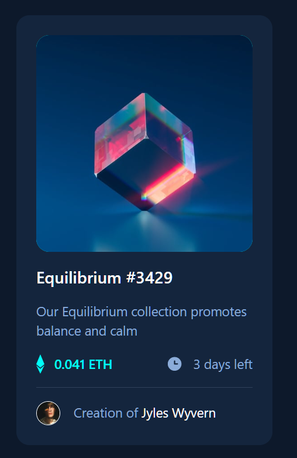
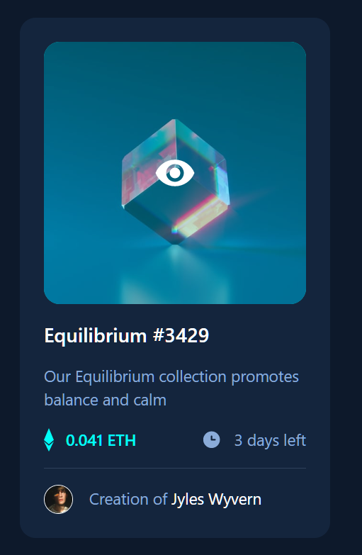

<h1 align="center">NFT Preview Card</h1>

  Made with <code>HTML</code>, <code>TailwindCSS</code>

  Built with <code>Webpack</code>

  
  

## ℹ️ About

This is a solution to the [NFT preview card component challenge on Frontend Mentor](https://www.frontendmentor.io/challenges/nft-preview-card-component-SbdUL_w0U).

The challenge is to build out an NFT Preview Card and get it looking as close to the design as possible.

See [task.md](./docs/task.md) for more details about the task.

Users should be able to:

- View the optimal layout depending on their device's screen size
- See hover states for interactive elements

## ⚙️ Tools

- **HTML5**
  - Semantic HTML
- **TailwindCSS**
  - Webpack + PostCSS + Tailwind
- **NodeJS**
- **Webpack**
- **Github Pages**
  - Hosting

## 🔨 Build project

<table>
  <tr>
    <th>Command</th>
    <th>Description</th>
  </tr>
  <tr>
    <td><code>npm&nbsp;install</code></td>
    <td>Installs required npm packages. Run it before building the project</td>
  </tr>
  <tr>
    <td><code>npm&nbsp;start</code></td>
    <td>Builds application in development mode, launches a server that opens in a new browser tab</td>
  </tr>
  <tr>
    <td><code>npm&nbsp;run&nbsp;dev</code></td>
    <td>Builds application in development mode, results may be found in <code>./build</code> folder</td>
  </tr>
  <tr>
    <td><code>npm&nbsp;run&nbsp;build</code></td>
    <td>Builds application in production mode, results may be found in <code>./build</code> folder. Files are minimized, hash added to filenames to help when dealing with caching</td>
  </tr>
</table>

## 📁 File Structure

<table>
  <tr>
    <th>Path</th>
    <th>Description</th>
  </tr>
  <tr>
    <td colspan="2"></td>
  </tr>
  <tr>
    <td><code>build</code></td>
    <td>Folder with files generated by Webpack</td>
  </tr>
  <tr>
    <td><code>static</code></td>
    <td>Folder with static assets (images, favicon)</td>
  </tr>
  <tr>
    <td colspan="2"></td>
  </tr>
  <tr>
    <td><code>src</code></td>
    <td>Source files needed for application development</td>
  </tr>
  <tr>
    <td><code>src / index.scss</code></td>
    <td>Main styles, Tailwind declarations</td>
  </tr>
  <tr>
    <td colspan="2"></td>
  </tr>
  <tr>
    <td><code>docs</code></td>
    <td>Folder with additional information, documentation</td>
  </tr>
  <tr>
    <td><code>docs / design</code></td>
    <td>Folder with images of how the interface must look like</td>
  </tr>
  <tr>
    <td><code>docs / results</code></td>
    <td>Folder with screenshots of how the application works after being fully developed</td>
  </tr>
  <tr>
    <td><code>docs / README-template.md</code></td>
    <td>Template for README.md, don't use it (from FrontendMentor)</td>
  </tr>
  <tr>
    <td><code>docs / style-guide.md</code></td>
    <td>Style information: color palette, fonts, etc. (from FrontendMentor)</td>
  </tr>
  <tr>
    <td><code>docs / task.md</code></td>
    <td>Detailed task description (from FrontendMentor)</td>
  </tr>
  <tr>
    <td><code>docs / nft-preview-card.zip</code></td>
    <td>Initial archive provided by Frontend Mentor</td>
  </tr>
  <tr>
    <td colspan="2"></td>
  </tr>
  <tr>
    <td><code>LICENSE</code></td>
    <td>MIT License</td>
  </tr>
  <tr>
    <td><code>package-lock.json</code></td>
    <td>JSON file that keeps track of the exact version of every package that is installed so that a product is 100% reproducible in the same way even if packages are updated by their maintainers</td>
  </tr>
  <tr>
    <td><code>package.json</code></td>
    <td>JSON file that holds various metadata relevant to the project. This file is used to give information to npm that allows it to identify the project as well as handle the project's dependencies</td>
  </tr>
  <tr>
    <td><code>.prettierrc</code></td>
    <td>Config for <a href="https://marketplace.visualstudio.com/items?itemName=esbenp.prettier-vscode">Prettier VS Code plugin</a></td>
  </tr>
  <tr>
    <td><code>webpack.common.js</code></td>
    <td>Contains configuration common for build and dev configs</td>
  </tr>
  <tr>
    <td><code>webpack.dev.js</code></td>
    <td>Contains configuration for development mode</td>
  </tr>
  <tr>
    <td><code>webpack.prod.js</code></td>
    <td>Contains configuration for production mode</td>
  </tr>
  <tr>
    <td><code>postcss.config.js</code></td>
    <td>PostCSS configuration file</td>
  </tr>
  <tr>
    <td><code>tailwind.config.js</code></td>
    <td>TailwindCSS configuration file</td>
  </tr>
  
</table>

## 📦 NPM Packages

<table>
  <tr>
    <th>Package</th>
    <th>Comment</th>
  </tr>
  <tr>
    <td><code>css-loader</code></td>
    <td>Is used by Webpack, resolves assets imported in css files, unites them in one file</td>
  </tr>
  <tr>
    <td><code>css&#8209minimizer&#8209webpack&#8209plugin</code></td>
    <td>Is used by Webpack, minifies css</td>
  </tr>
  <tr>
    <td><code>html-loader</code></td>
    <td>Is used by Webpack, resolves assets in html files. (Mode production works perfectly without it, but development mode for some reason sometimes loses some assets referred in html...)</td>
  </tr>
  <tr>
    <td><code>html&#8209webpack&#8209plugin</code></td>
    <td>Is used by Webpack, generates a html file from a template. Minifies html, adds links to js, css</td>
  </tr>
  <tr>
    <td><code>mini-css-extract-plugin</code></td>
    <td>Extracts transpiled css in a separate css file</td>
  </tr>
  <tr>
    <td><code>postcss</code></td>
    <td>Is used by Webpack, converts css written with PostCSS plugins to plain css</td>
  </tr>
  <tr>
    <td><code>postcss-loader</code></td>
    <td>Is used by Webpack, converts to css using postcss package</td>
  </tr>
  <tr>
    <td><code>postcss-preset-env</code></td>
    <td>Comes with PostCSS</td>
  </tr>
  <tr>
    <td><code>style-loader</code></td>
    <td>Injects CSS in index.html (used for dev mode only)</td>
  </tr>
  <tr>
    <td><code>tailwindcss</code></td>
    <td>CSS framework, works as a plugin to PostCSS</td>
  </tr>
  <tr>
    <td><code>terser-webpack-plugin</code></td>
    <td>Is used by Webpack, minifies js (comes with webpack, no need to install it separately)</td>
  </tr>
  <tr>
    <td><code>webpack</code></td>
    <td>Module bundler</td>
  </tr>
  <tr>
    <td><code>webpack-cli</code></td>
    <td>Required for work of webpack with v4 or later</td>
  </tr>
  <tr>
    <td><code>webpack-dev-server</code></td>
    <td>Launches developer server that automatically applies all changes in code</td>
  </tr>
  <tr>
    <td><code>webpack-merge</code></td>
    <td>Helps to merge configs (webpack.common.js + webpack.dev.js for example)</td>
  </tr>
  
</table>

## 💡 Details

### Working with TailwindCSS

Decided to experiment and use Tailwind for styles. Not just use, but combine it with Webpack. Took some time to configure everything together, but it worked.

### Other notes

- Hover on link
- Hover on h1
- Hover on image

## 🔗 Useful resources

- [Snippets for Tailwind](https://nerdcave.com/tailwind-cheat-sheet) - Highly recommend! Greatly saves time
- [Tailwind Docs](https://v2.tailwindcss.com/)
- [Setup Webpack with Tailwind CSS](https://gist.github.com/bradtraversy/1c93938c1fe4f10d1e5b0532ae22e16a)
- [Prettier: VS Code plugin](https://marketplace.visualstudio.com/items?itemName=esbenp.prettier-vscode)
- [Tailwind CSS IntelliSense: VS Code plugin](https://marketplace.visualstudio.com/items?itemName=bradlc.vscode-tailwindcss)

## 👤 Author

- Frontend Mentor - [@GrbnvAlex](https://www.frontendmentor.io/profile/GrbnvAlex)
- Telegram - [@Arlagonix](https://t.me/Arlagonix)
- Github - [@arlagonix](https://github.com/arlagonix)
